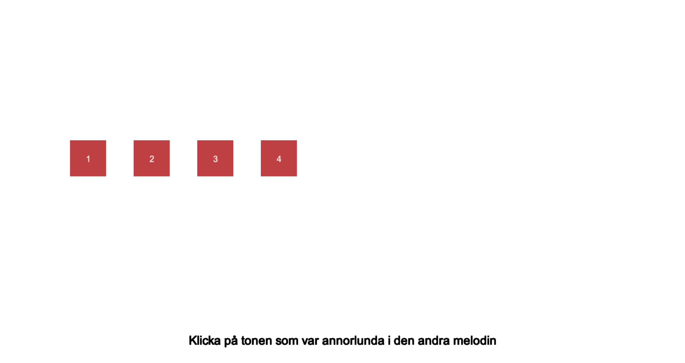
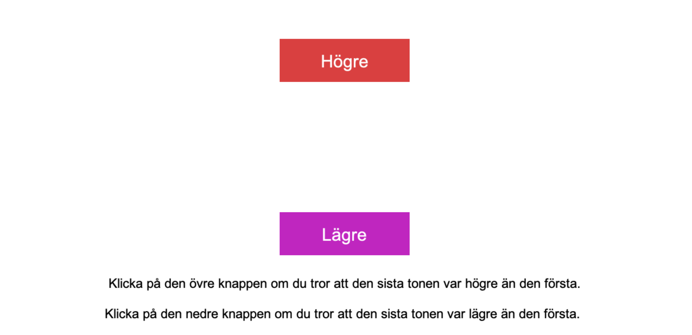
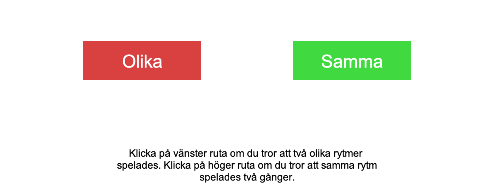

# PsychoPy implementation of the Swedish Musical Discrimination Test

This is a collection of [PsychoPy](https://psychopy.org/) experiments implementing the [Swedish Musical Discrimination Test](https://www.sciencedirect.com/science/article/pii/S0191886914000841)(SMDT) in Swedish. Each subtest of the SMDT is implemented as a stand-alone PsychoPy experiment, each placed in its own subdirectory in this code repository. Please see the README files in the subdirectories for more information on each experiment, e.g. instructions on how to translate or run them. (on GitHub, you can click a folder in the 'code view' at the top to see the README for that folder)

## Downloading all the experiment files from GitHub
You can download this project, by either using the green 'code' button and selecting 'Download ZIP', or by using `git clone` if you know Git.

## Monitor setup
Note that for all experiments, you will need to update the monitor settings in PsychoPy to be in agreement with your physical monitor. Please see the [official PsychoPy documentation](https://www.psychopy.org/builder/builderMonitors.html) for more information about this.

## Attribution
The SMDT was developed at Karolinska Institutet's Department of Neuroscience by a research group led by Prof. Fredrik Ullén. This PsychoPy implementation was created by Lowe Wilsson.

You are free to use and modify this project for non-commercial purposes (e.g. research is OK) __with attribution__. If you publish articles or share other work based on this project (e.g. if you share a modified version of it), you are required to include the following two articles as references:
* Ullén, F, Mosing, MA, Holm, L, Eriksson, H, Madison, G (2014). Psychometric properties and heritability of a new online test for musicality, the Swedish Musical Discrimination Test. _Personality and Individual Differences 63_, 87-93. [https://doi.org/10.1016/j.paid.2014.01.057](https://doi.org/10.1016/j.paid.2014.01.057)
* Mosing, MA, Madison, G, Pedersen, NL, Kuja-Halkola, R, Ullén, F. (2014). Practice does not make perfect: No causal effect of musical practice on musical ability. _Psychological Science 25(9)_, pp. 1795-803. [https://doi.org/10.1177/0956797614541990](https://doi.org/10.1177/0956797614541990)

It's not required, but it's appreciated if you also share a link to this project's code repository [https://github.com/datalowe/psychopy-smdt](https://github.com/datalowe/psychopy-smdt) in order to help spread the word.
